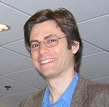

<strong>Max Erik Tegmark</strong>&nbsp;(born 5 May 1967) is a&nbsp;<a title="Swedish Americans" href="https://en.wikipedia.org/wiki/Swedish_Americans">Swedish-American</a>&nbsp;physicist,&nbsp;<a title="Cosmology" href="https://en.wikipedia.org/wiki/Cosmology">cosmologist</a>&nbsp;and machine learning researcher. He is a professor at the&nbsp;<a title="Massachusetts Institute of Technology" href="https://en.wikipedia.org/wiki/Massachusetts_Institute_of_Technology">Massachusetts Institute of Technology</a>&nbsp;and the scientific director of the&nbsp;<a title="Foundational Questions Institute" href="https://en.wikipedia.org/wiki/Foundational_Questions_Institute">Foundational Questions Institute</a>. He is also a co-founder of the&nbsp;<a title="Future of Life Institute" href="https://en.wikipedia.org/wiki/Future_of_Life_Institute">Future of Life Institute</a>&nbsp;and a supporter of the&nbsp;<a title="Effective altruism" href="https://en.wikipedia.org/wiki/Effective_altruism">effective altruism movement</a>, and has received donations from&nbsp;<a title="Elon Musk" href="https://en.wikipedia.org/wiki/Elon_Musk">Elon Musk</a>&nbsp;to investigate&nbsp;<a class="mw-redirect" title="Existential risk from advanced artificial intelligence" href="https://en.wikipedia.org/wiki/Existential_risk_from_advanced_artificial_intelligence">existential risk from advanced artificial intelligence</a>.

 

<table class="infobox biography vcard">
<tbody>
<tr>
<th colspan="2">

Max Tegmark

</th>
</tr>
<tr>
<td colspan="2"></td>
</tr>
<tr>
<th scope="row">Born</th>
<td>May 5, 1967&nbsp;(age&nbsp;53) 

Sweden

</td>
</tr>
<tr>
<th scope="row">Nationality</th>
<td class="category">Swedish American</td>
</tr>
<tr>
<th scope="row">Alma&nbsp;mater</th>
<td><a class="mw-redirect" title="Royal Institute of Technology" href="https://en.wikipedia.org/wiki/Royal_Institute_of_Technology">Royal Institute of Technology</a> <a title="University of California, Berkeley" href="https://en.wikipedia.org/wiki/University_of_California,_Berkeley">UC Berkeley</a></td>
</tr>
<tr>
<td colspan="2"><strong>Scientific career</strong></td>
</tr>
<tr>
<th scope="row">Fields</th>
<td class="category"><a title="Cosmology" href="https://en.wikipedia.org/wiki/Cosmology">Cosmology</a>,&nbsp;<a title="Physics" href="https://en.wikipedia.org/wiki/Physics">physics</a>,&nbsp;<a title="Machine learning" href="https://en.wikipedia.org/wiki/Machine_learning">machine learning</a></td>
</tr>
<tr>
<th scope="row">Institutions</th>
<td><a title="Massachusetts Institute of Technology" href="https://en.wikipedia.org/wiki/Massachusetts_Institute_of_Technology">MIT</a></td>
</tr>
<tr>
<th scope="row"><a title="Doctoral advisor" href="https://en.wikipedia.org/wiki/Doctoral_advisor">Doctoral advisor</a></th>
<td><a title="Joseph Silk" href="https://en.wikipedia.org/wiki/Joseph_Silk">Joseph Silk</a></td>
</tr>
</tbody>
</table>

 
<h2> Books </h2>
<ul>

                             

 <li><a target="_blank" href="https://github.com/manjunath5496/Max-Tegmark-Publications/blob/master/max(1).pdf" style="text-decoration:none;">The Mathematical Universe</a></li>

 <li><a target="_blank" href="https://github.com/manjunath5496/Max-Tegmark-Publications/blob/master/max(2).pdf" style="text-decoration:none;">A Model of Diffuse Galactic Radio Emission from 10 MHz to 100 GHz</a></li>

<li><a target="_blank" href="https://github.com/manjunath5496/Max-Tegmark-Publications/blob/master/max(3).pdf" style="text-decoration:none;">How accurately can 21 cm tomography constrain cosmology?</a></li>
 <li><a target="_blank" href="https://github.com/manjunath5496/Max-Tegmark-Publications/blob/master/max(4).pdf" style="text-decoration:none;">The Fast Fourier Transform Telescope</a></li>                              
<li><a target="_blank" href="https://github.com/manjunath5496/Max-Tegmark-Publications/blob/master/max(5).pdf" style="text-decoration:none;">Axion Cosmology and the Energy Scale of Inflation</a></li>
<li><a target="_blank" href="https://github.com/manjunath5496/Max-Tegmark-Publications/blob/master/max(6).pdf" style="text-decoration:none;">Why does deep and cheap learning work so well?</a></li>
 <li><a target="_blank" href="https://github.com/manjunath5496/Max-Tegmark-Publications/blob/master/max(7).pdf" style="text-decoration:none;">Is cosmology consistent?</a></li>

 <li><a target="_blank" href="https://github.com/manjunath5496/Max-Tegmark-Publications/blob/master/max(8).pdf" style="text-decoration:none;"> The End of Unified Dark Matter?</a></li>
   <li><a target="_blank" href="https://github.com/manjunath5496/Max-Tegmark-Publications/blob/master/max(9).pdf" style="text-decoration:none;">On Departures From a Power Law in the Galaxy Correlation Function</a></li>
  
   
 <li><a target="_blank" href="https://github.com/manjunath5496/Max-Tegmark-Publications/blob/master/max(10).pdf" style="text-decoration:none;">A high resolution foreground cleaned CMB map from WMAP</a></li>                              
<li><a target="_blank" href="https://github.com/manjunath5496/Max-Tegmark-Publications/blob/master/max(11).pdf" style="text-decoration:none;">The significance of the largest scale CMB fluctuations in WMAP</a></li>
<li><a target="_blank" href="https://github.com/manjunath5496/Max-Tegmark-Publications/blob/master/max(12).pdf" style="text-decoration:none;">Cosmological parameters from SDSS and WMAP</a></li>
<li><a target="_blank" href="https://github.com/manjunath5496/Max-Tegmark-Publications/blob/master/max(13).pdf" style="text-decoration:none;">The Three-Dimensional Power Spectrum of Galaxies from the Sloan Digital Sky Survey</a></li>

<li><a target="_blank" href="https://github.com/manjunath5496/Max-Tegmark-Publications/blob/master/max(14).pdf" style="text-decoration:none;">What does inflation really predict?</a></li>
                              
<li><a target="_blank" href="https://github.com/manjunath5496/Max-Tegmark-Publications/blob/master/max(15).pdf" style="text-decoration:none;">Limits on non-Gaussianities from WMAP data</a></li>

<li><a target="_blank" href="https://github.com/manjunath5496/Max-Tegmark-Publications/blob/master/max(16).pdf" style="text-decoration:none;">A method for subtracting foregrounds from multi-frequency CMB sky maps</a></li>

  <li><a target="_blank" href="https://github.com/manjunath5496/Max-Tegmark-Publications/blob/master/max(17).pdf" style="text-decoration:none;">Karhunen-Loève Eigenvalue Problems in Cosmology: How should we Tackle Large Data Sets?</a></li>   
  
<li><a target="_blank" href="https://github.com/manjunath5496/Max-Tegmark-Publications/blob/master/max(18).pdf" style="text-decoration:none;">How to measure CMB power spectra without losing information</a></li> 

  
<li><a target="_blank" href="https://github.com/manjunath5496/Max-Tegmark-Publications/blob/master/max(19).pdf" style="text-decoration:none;">Forecasting Cosmic Parameter Errors from Microwave Background Anisotropy Experiments</a></li> 

<li><a target="_blank" href="https://github.com/manjunath5496/Max-Tegmark-Publications/blob/master/max(20).pdf" style="text-decoration:none;">Is "the theory of everything" merely the ultimate ensemble theory?</a></li>

<li><a target="_blank" href="https://github.com/manjunath5496/Max-Tegmark-Publications/blob/master/max(21).pdf" style="text-decoration:none;">CMB mapping experiments: a designer's guide</a></li>
<li><a target="_blank" href="https://github.com/manjunath5496/Max-Tegmark-Publications/blob/master/max(22).pdf" style="text-decoration:none;">Measuring Cosmological Parameters with Galaxy Surveys</a></li> 
 <li><a target="_blank" href="https://github.com/manjunath5496/Max-Tegmark-Publications/blob/master/max(23).pdf" style="text-decoration:none;">The Interpretation of Quantum Mechanics: Many Worlds or Many Words?</a></li> 
 

   <li><a target="_blank" href="https://github.com/manjunath5496/Max-Tegmark-Publications/blob/master/max(24).pdf" style="text-decoration:none;">Weighing Neutrinos with Galaxy Surveys</a></li>
 
   <li><a target="_blank" href="https://github.com/manjunath5496/Max-Tegmark-Publications/blob/master/max(25).pdf" style="text-decoration:none;">The time-evolution of bias</a></li>                              
 <li><a target="_blank" href="https://github.com/manjunath5496/Max-Tegmark-Publications/blob/master/max(26).pdf" style="text-decoration:none;">Observationally Determining the Properties of Dark Matter</a></li>
 <li><a target="_blank" href="https://github.com/manjunath5496/Max-Tegmark-Publications/blob/master/max(27).pdf" style="text-decoration:none;">Foregrounds and Forecasts for the Cosmic Microwave Background</a></li>
   
 
   <li><a target="_blank" href="https://github.com/manjunath5496/Max-Tegmark-Publications/blob/master/max(28).pdf" style="text-decoration:none;">The Importance of Quantum Decoherence in Brain Processes</a></li>
 
   <li><a target="_blank" href="https://github.com/manjunath5496/Max-Tegmark-Publications/blob/master/max(29).pdf" style="text-decoration:none;">Cosmic Complementarity: Joint Parameter Estimation from Cosmic Microwave Background Experiments and Redshift Surveys</a></li>                              

  <li><a target="_blank" href="https://github.com/manjunath5496/Max-Tegmark-Publications/blob/master/max(30).pdf" style="text-decoration:none;">Cosmic Microwave Background Observables and Their Cosmological Implications</a></li>
 
   <li><a target="_blank" href="https://github.com/manjunath5496/Max-Tegmark-Publications/blob/master/max(31).pdf" style="text-decoration:none;"> Life 3.0 : being human in the age of artificial intelligence</a></li> 
    <li><a target="_blank" href="https://github.com/manjunath5496/Max-Tegmark-Publications/blob/master/max(32).pdf" style="text-decoration:none;">Our mathematical universe: my quest for the ultimate nature of reality</a></li> 

   <li><a target="_blank" href="https://github.com/manjunath5496/Max-Tegmark-Publications/blob/master/max(33).pdf" style="text-decoration:none;">The clustering of luminous red galaxies in the Sloan Digital Sky Survey imaging data</a></li>                              

  <li><a target="_blank" href="https://github.com/manjunath5496/Max-Tegmark-Publications/blob/master/max(34).pdf" style="text-decoration:none;">A Map of the Universe</a></li> 
 
  <li><a target="_blank" href="https://github.com/manjunath5496/Max-Tegmark-Publications/blob/master/max(35).pdf" style="text-decoration:none;">Parallel Universes</a></li> 

  <li><a target="_blank" href="https://github.com/manjunath5496/Max-Tegmark-Publications/blob/master/max(36).pdf" style="text-decoration:none;">The Shape of the Sloan Digital Sky Survey Data Release 5 Galaxy Power Spectrum</a></li> 
 
<li><a target="_blank" href="https://github.com/manjunath5496/Max-Tegmark-Publications/blob/master/max(37).pdf" style="text-decoration:none;">100 years of quantum mysteries</a></li>
 <li><a target="_blank" href="https://github.com/manjunath5496/Max-Tegmark-Publications/blob/master/max(38).pdf" style="text-decoration:none;">Research Priorities for Robust and Beneficial Artificial Intelligence</a></li>
<li><a target="_blank" href="https://github.com/manjunath5496/Max-Tegmark-Publications/blob/master/max(39).pdf" style="text-decoration:none;">Why Is the Cosmic Microwave Background Fluctuation Level 10−5?</a></li>
 <li><a target="_blank" href="https://github.com/manjunath5496/Max-Tegmark-Publications/blob/master/max(40).pdf" style="text-decoration:none;">Dimensionless constants, cosmology, and other dark matters</a></li>                              
<li><a target="_blank" href="https://github.com/manjunath5496/Max-Tegmark-Publications/blob/master/max(41).pdf" style="text-decoration:none;">On the dimensionality of spacetime</a></li>
<li><a target="_blank" href="https://github.com/manjunath5496/Max-Tegmark-Publications/blob/master/max(42).pdf" style="text-decoration:none;">Interview: Max Tegmark on Superintelligent AI, Cosmic Apocalypse, and Life 3.0</a></li>
</ul>
